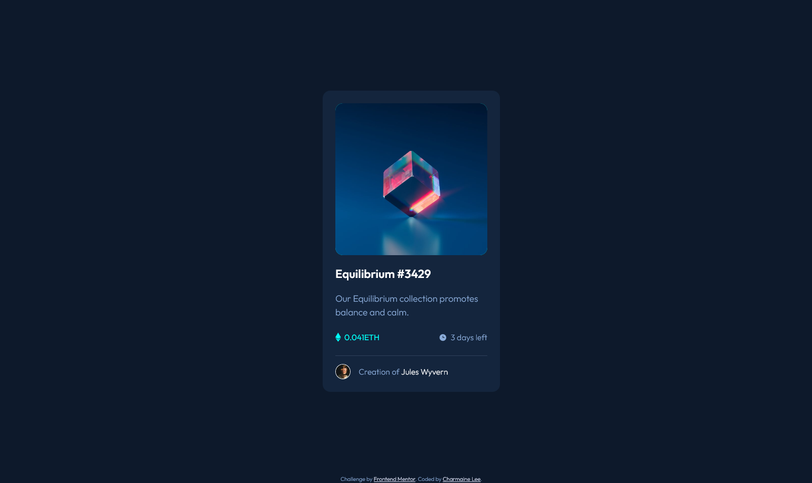

# Frontend Mentor - NFT preview card component solution

This is a solution to the [NFT preview card component challenge on Frontend Mentor](https://www.frontendmentor.io/challenges/nft-preview-card-component-SbdUL_w0U). Frontend Mentor challenges help you improve your coding skills by building realistic projects.

## Table of contents

- [Overview](#overview)
  - [The challenge](#the-challenge)
  - [Screenshot](#screenshot)
  - [Links](#links)
- [My process](#my-process)
  - [Built with](#built-with)
  - [What I learned](#what-i-learned)
  - [Continued development](#continued-development)
  - [Useful resources](#useful-resources)
- [Author](#author)
- [Acknowledgments](#acknowledgments)

## Overview

### The challenge

Users should be able to:

- View the optimal layout depending on their device's screen size
- See hover states for interactive elements

### Screenshot

### Links

- Solution URL: [Click here!](https://www.frontendmentor.io/solutions/responsive-preview-card-component-using-html-css-flexbox-wqtKC11zG)
- Live Site URL: [Click here!](https://trusting-mayer-a6f848.netlify.app/)

## My process

### Built with

- Semantic HTML5 markup
- CSS custom properties
- Flexbox
- Mobile-first workflow

### What I learned

- Practiced pseudo-elements
  - Using pseudo-elements to add the view icon on the image, and changing its hover state
- Adjusting icon with padding so that they can align properly with text

### Continued development

- More practice on pseudo-elements
- Using grid instead of flex to position items as I have been relying a lot on flexbox recently

### Useful resources

- [Using pseudo elements to add image to a modal](https://stackoverflow.com/questions/6668577/using-before-css-pseucso-element-to-add-image-to-modal) - This has helped me in understanding how to properly add an image using the content property, and other properties that should be included to ensure you can make the image appear to be what you expect.
- [Pseudo elements as design elements](https://www.youtube.com/watch?v=djbtPnNmc0I) - This tutorial provides various tips and tricks on using pseudo elements to design a webpage.

## Author

- LinkedIn - [Charmaine Lee](https://www.linkedin.com/in/charmainelee-huimin/)
- Frontend Mentor - [@charmainelhm](https://www.frontendmentor.io/profile/charmainelhm)
- Twitter - [@noodercob_ie](https://www.twitter.com/noodercob_ie)

## Acknowledgments

Practice is a very important learning stage in coding, and I want to thank [Frontend Mentor](https://www.frontendmentor.io/) for making it easier for me to do that. With their help, I can focus on understanding the different properties in HTML and CSS even though I have very little knowledge on UI and UX design.
